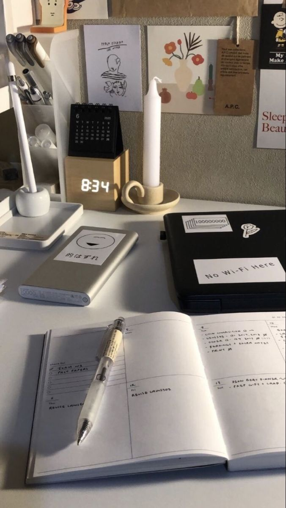

[my favorite website](http://www.pinterest.com)

زمانی که با خانوم سارا کدیری صحبت میکردم از ایشان درمورد برنامه ریزی روزانشون پرسیدم به من گفتن که استفاده از برنامه کلندر میتواند مفید باشد.اما گفتن که خودشون با مداد دست گرفتن و نوشتن راحت تر هستند و اینکه یک سالنامه دارند که در اون تاریخ تمام ددلاین هاشون و امتحان هارو مینویسن.
در حین صحبت هاشون به این اشاره کردن که بعضی وقتها پیش میاد که خودشون هم از برنامه عقب بمونن :) و در خصوص صرفه جویی در زمان گفتن که سر کلاس ها حتما حاضر باشیم و گوش بدیم تا لازم نباشه حتما فیلم ضبط شده رو ببینیم و در صورت نیاز بهشون مراجعه کنیم و سعی کنیم پا به پای کلاس پیش بریم و تمرین هارو انجام بدیم تا آخر ترم همه چیز برامون جدید نباشه.
و در آخر صحبت هاشون بهم گفتن که حتما هر سوالی داشتیم حتی اگه به نظرمون کوچیک بود بپرسیم.

--

